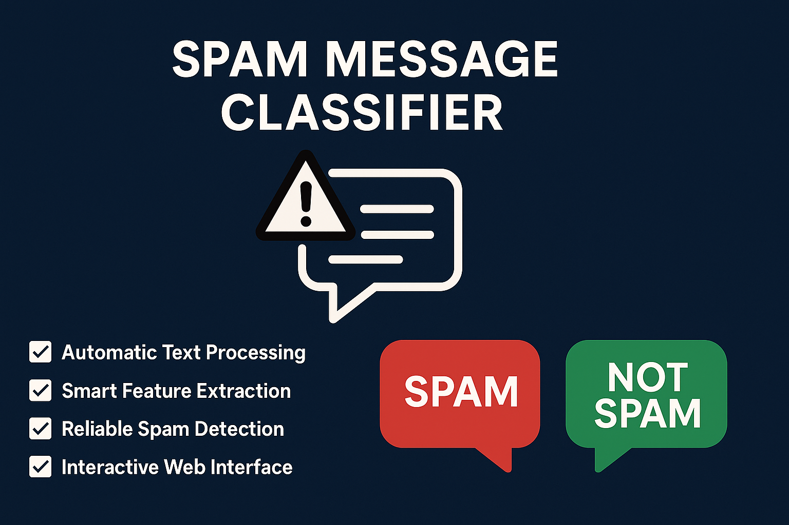
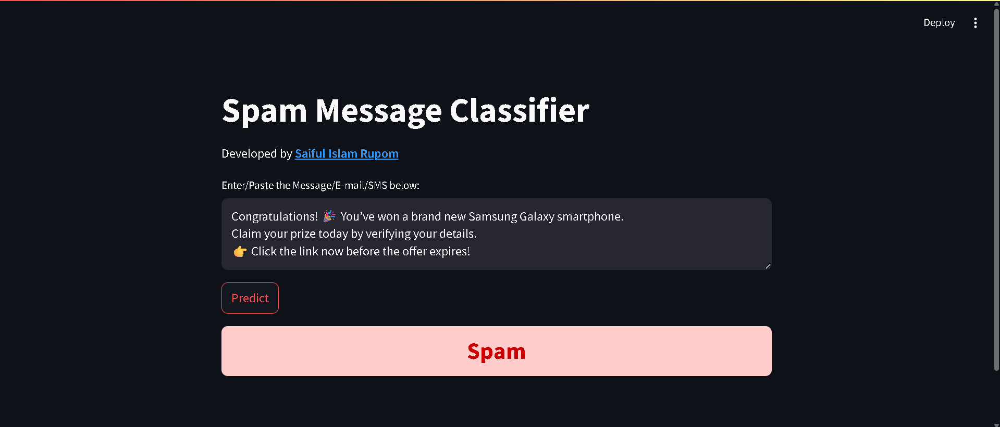

# Spam Message Classifier
**Live App**: [Click to Try the App](https://saiful-islam-rupom-spam-message-classifier.streamlit.app/)

## Overview
This project combines Machine Learning classification techniques with Natural Language Processing (NLP) to detect whether an incoming SMS, email, or text message is Spam or Not Spam. The system is powered by TF-IDF vectorization for text feature extraction and a Multinomial Naive Bayes classifier.

## Objective
Develop a reliable tool- Spam Message Classifier using NLP and machine learning, including text preprocessing, model training and evaluation, and a user-friendly web interface for Spam/Not Spam predictions.

## Project Features
- **Automatic Text Processing:** Cleans and prepares messages using NLP techniques (lowercasing, tokenization, stopword removal, stemming).
- **Smart Feature Extraction:** Converts text into numerical format using TF-IDF for accurate predictions.
- **Reliable Spam Detection:** Uses a trained Multinomial Naive Bayes model to classify messages as Spam or Not Spam.
- **Interactive Web Interface:** Real-time message classification through a Streamlit app.
- **Visual Feedback:** Color-coded results for quick identification.

## Project Workflow
This project follows a structured workflow combining data cleaning, EDA, data preprocessing, natural language processing (NLP), machine learning, model training and evaluation, and frontend deployment using Streamlit.

### 1. Data Collection & Exploration
- Collected the 'spam_raw.csv' dataset from Kaggle.com
- Load the dataset.
- Checked for duplicates, null values, and cleaned the dataset.
- Performed EDA to understand dataset balance and message distribution.

### 2. Data Preprocessing
- Converted text to lowercase.
- Tokenized text into words using NLTK tokenizer.
- Removed stopwords and punctuation.
- Applied PorterStemmer to reduce words to their root form.
- Reconstructed cleaned words into processed text.

### 3. Feature Engineering
- Converted cleaned text into numerical vectors using TF-IDF Vectorizer.
- Split data into training and testing sets.

### 4. Model Training & Evaluation
- Trained and tested three Naive Bayes models:
  - GaussianNB
  - BernoulliNB
  - MultinomialNB (best performer)
- Evaluated models with Accuracy and Precision Score.
- Saved the final model (model.pkl) and TF-IDF vectorizer (vectorizer.pkl) using Pickle.

### 5. Application Development
- Built an interactive Streamlit web app.
- Loaded the trained model and vectorizer.
- Applied the same preprocessing pipeline to user input.
- Classified messages as Spam or Not Spam with styled output.

### 6. Output & User Interaction
- Users enter any SMS/email/text in the web interface.
- The classifier processes the input and predicts the category.
- Results are displayed in a color-coded message box for clarity.

## App Snapshot

## Future Enhancements
- Add support for multilingual spam detection
- Experiment with advanced models such as LSTMs, BERT, or Transformers
- Show probability scores & explainability insights for each prediction
- Enhance the UI/UX with charts and additional statistics

## License
This project is licensed under the [MIT License](LICENSE)

## Author
[Saiful Islam Rupom](https://www.linkedin.com/in/saiful-islam-rupom/); Email: saifulislam558855@gmail.com
